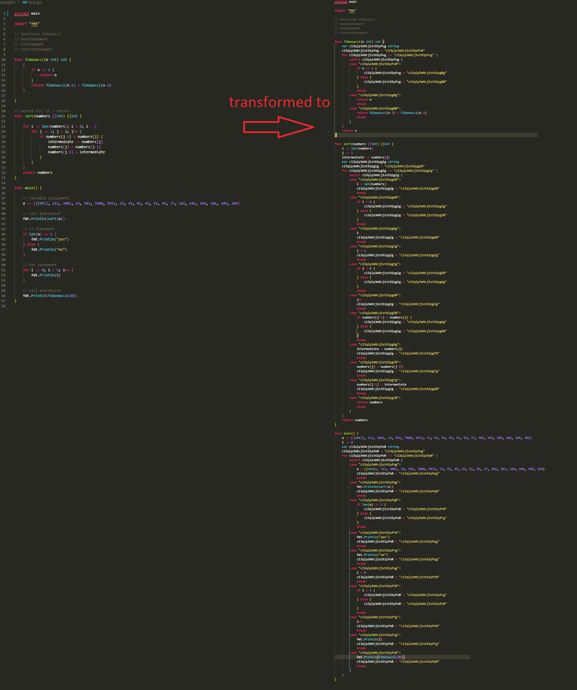
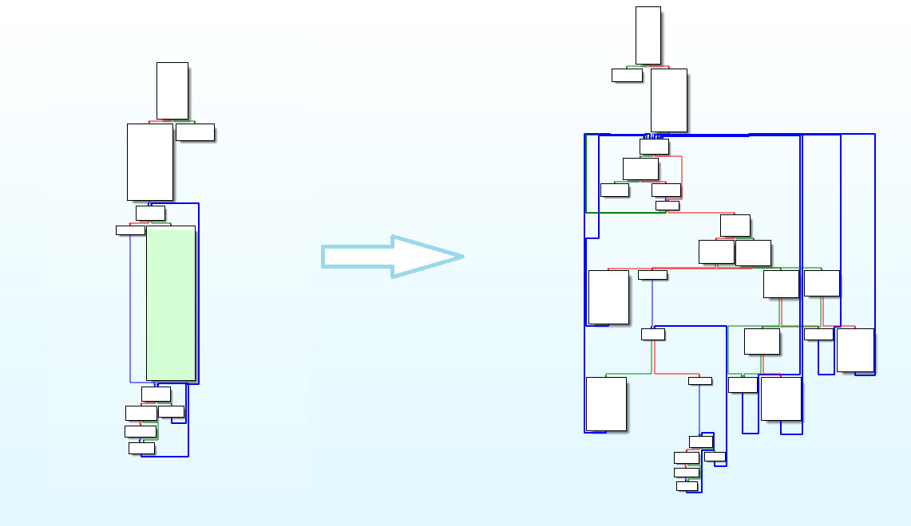

# ejja

A modular Go source code level control flow obfuscator, made in Go.

Runs the selected module on the target project.


## Demonstration


## Quick Start

Usage:

```golang
λ ejja run --project "samples" --module "flattener" --functions "main","fibonacci"
[+] Running flattener..
[+] Found function `main` in `test.go` ..

[+] Emitting transformed function..

func main(){
        a := []int{2, 212, 3001, 14, 501, 7800, 9932, 33, 45, 45, 45, 91, 99, 37, 102, 102, 104, 106, 109, 106}
        i := 0
        var c13qkfjm9cj2a64v7a10 string
        c13qkfjm9cj2a64v7a10 = "c13qkfjm9cj2a64v7a1g"
        for c13qkfjm9cj2a64v7a10 != "c13qkfjm9cj2a64v7a20" {
                switch(c13qkfjm9cj2a64v7a10){
                case "c13qkfjm9cj2a64v7a1g":
                        a = []int{2, 212, 3001, 14, 501, 7800, 9932, 33, 45, 45, 45, 91, 99, 37, 102, 102, 104, 106, 109, 106}
                        c13qkfjm9cj2a64v7a10 = "c13qkfjm9cj2a64v7a2g"
                        break
                case "c13qkfjm9cj2a64v7a2g":
                        fmt.Println(sort(a))
                        c13qkfjm9cj2a64v7a10 = "c13qkfjm9cj2a64v7a30"
                        break
                case "c13qkfjm9cj2a64v7a30":
                        if (len(a) >= 1) {
                                c13qkfjm9cj2a64v7a10 = "c13qkfjm9cj2a64v7a40"
                        }else{
                                c13qkfjm9cj2a64v7a10 = "c13qkfjm9cj2a64v7a4g"
                        }
                        break
                case "c13qkfjm9cj2a64v7a40":
                        fmt.Println("yes")
                        c13qkfjm9cj2a64v7a10 = "c13qkfjm9cj2a64v7a3g"
                        break
                case "c13qkfjm9cj2a64v7a4g":
                        fmt.Println("no")
                        c13qkfjm9cj2a64v7a10 = "c13qkfjm9cj2a64v7a3g"
                        break
                case "c13qkfjm9cj2a64v7a3g":
                        i = 0
                        c13qkfjm9cj2a64v7a10 = "c13qkfjm9cj2a64v7a60"
                        break
                case "c13qkfjm9cj2a64v7a60":
                        if i < 5 {
                                c13qkfjm9cj2a64v7a10 = "c13qkfjm9cj2a64v7a5g"
                        }else{
                                c13qkfjm9cj2a64v7a10 = "c13qkfjm9cj2a64v7a50"
                        }
                        break
                case "c13qkfjm9cj2a64v7a6g":
                        i++
                        c13qkfjm9cj2a64v7a10 = "c13qkfjm9cj2a64v7a60"
                        break
                case "c13qkfjm9cj2a64v7a5g":
                        fmt.Println(i)
                        c13qkfjm9cj2a64v7a10 = "c13qkfjm9cj2a64v7a6g"
                        break
                case "c13qkfjm9cj2a64v7a50":
                        fmt.Println(fibonacci(30))
                        c13qkfjm9cj2a64v7a10 = "c13qkfjm9cj2a64v7a20"
                        break
                }
        }
}

[+] Emitting transformed function..

func fibonacci(n int) int{
        var c13qksrm9cj2kg5kgif0 string
        c13qksrm9cj2kg5kgif0 = "c13qksrm9cj2kg5kgifg"
        for c13qksrm9cj2kg5kgif0 != "c13qksrm9cj2kg5kgig0" {
                switch(c13qksrm9cj2kg5kgif0){
                case "c13qksrm9cj2kg5kgifg":
                        if (n <= 1) {
                                c13qksrm9cj2kg5kgif0 = "c13qksrm9cj2kg5kgih0"
                        }else{
                                c13qksrm9cj2kg5kgif0 = "c13qksrm9cj2kg5kgigg"
                        }
                        break
                case "c13qksrm9cj2kg5kgih0":
                        return n
                        break
                case "c13qksrm9cj2kg5kgigg":
                        return fibonacci(n-1) + fibonacci(n-2)
                        break
                }
        }
        return n
}

[+] Done.

λ ejja run --project "C:\Users\kaftejiman\sampleGolangProject" --module "analyser"

[+] Running analyser..

=== Object Summary ===

basic objects        : 2
array objects        : 2
slice objects        : 13
struct objects       : 5
pointer objects      : 2
tuple objects        : 1
signature objects    : 29
interface objects    : 3
map objects          : 0
chan objects         : 1

[+] Done.
```

## Available Modules

### Flattener

Flattens the target function's control flow graph.

Implementation of the flattener algorithm in ["OBFUSCATING C++ PROGRAMS VIA CONTROL FLOW FLATTENING" by T. L ́aszl ́o and ́A. Kiss](http://ac.inf.elte.hu/Vol_030_2009/003.pdf).

* Name: flattener
* Usage: `ejja --project="example/project" --module="flattener" --function="main"`
* Description: *The idea behind control flow flattening is to transform the structure of the source code in such a way that the targets of branches cannot be easily determined by static analysis, thus hindering the comprehension of the program.*  

#### Before/After source code level
  


#### Before/After binary level (IDA 7.0)





### Analyser

Displays object metrics about the target project codebase, returns summary of object analysis.

* Name: analyser
* Usage: `ejja --project="example/project" --module="analyser"`
* Description: *Runs an analysis on the target project's codebase, returns summary of object analysis.*

## Install


## How to contribute your own module

Each module should export two required methods:
 * `Manifest()` -- Module manifestation with a unique name and description.
 * `Run()` -- The entry point of the module.

You can use helper functions found in utils. They provide basic ast operations.

You can find a sample module in samples folder, move the sample module to `modules` folder for actually running.

## Known issues

Flattener module is lacking a lot as of now, I will be supporting more statements asap, feel free to PR.

Supported statements:
* ExprStatements
* IfStatements
* ForStatements
* ReturnStatements
* AssignmentStatements
## Release Notes

**[CHANGELOG](https://github.com/kaftejiman/ejja/blob/main/CHANGELOG.md)**

